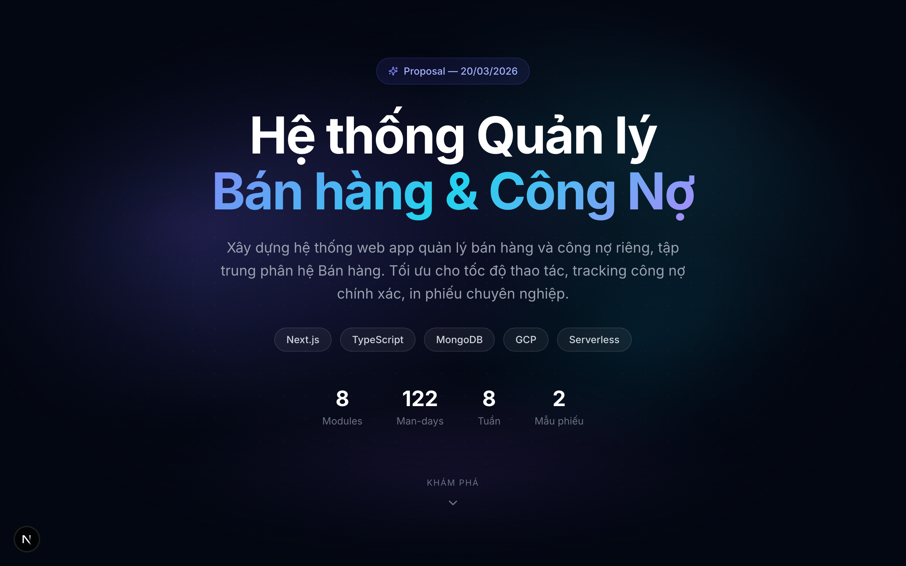
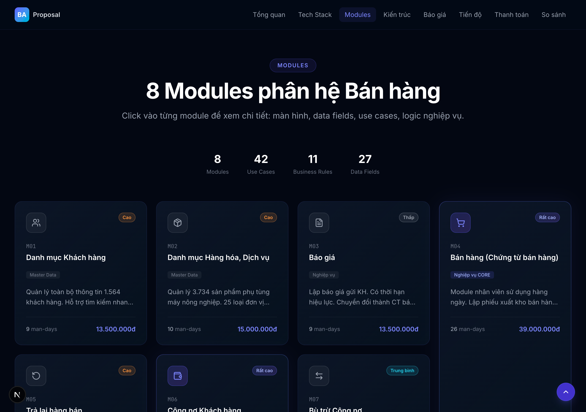
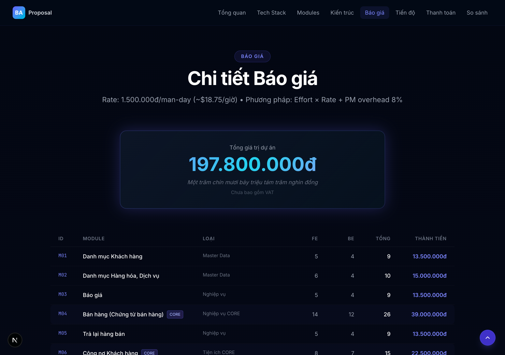
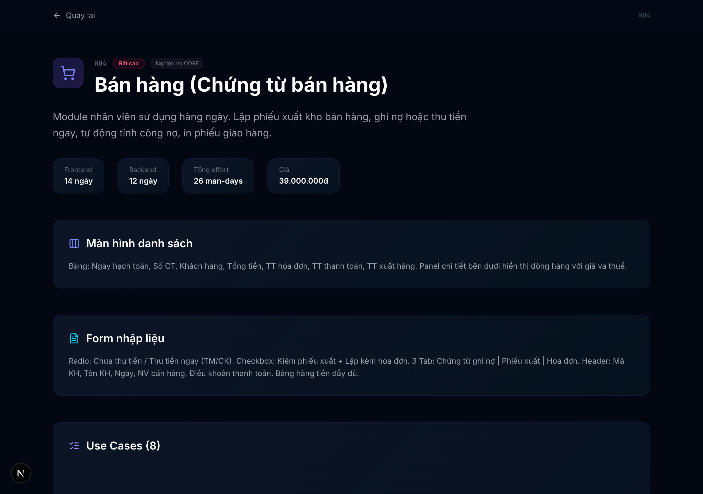

<div align="center">

# Hệ thống Quản lý Bán hàng & Công Nợ

### Production-Grade Clone MISA AMIS — Phân hệ Bán hàng

[](https://nextjs.org/)
[](https://www.typescriptlang.org/)
[](https://tailwindcss.com/)
[](https://www.framer.com/motion/)
[](https://web-info-nine.vercel.app)

**Website trình bày BA Document & Báo giá dự án phần mềm quản lý bán hàng & công nợ.**
Được thiết kế để thuyết trình cho khách hàng — trình bày chi tiết modules, diagrams, use cases, flows và báo giá.

[**Live Demo →**](https://web-info-nine.vercel.app)

</div>

---



## Giới thiệu

Website tĩnh (static export) trình bày toàn bộ phân tích nghiệp vụ (BA) và báo giá cho dự án phần mềm **quản lý bán hàng & công nợ** — clone production-grade MISA AMIS, tập trung phân hệ Bán hàng.

**Mục đích**: Dùng để **thuyết trình cho khách hàng**, không phải phần mềm thực tế.

### Điểm nổi bật

- **Dark theme** chuyên nghiệp với animated gradient mesh
- **Glassmorphism navigation** — floating, backdrop-blur, highlight section đang xem
- **Scroll animations** — reveal từng section khi scroll (Framer Motion)
- **Glow cards** với gradient border + hover effects
- **Animated counters** cho số liệu tài chính
- **12 module detail pages** — click vào từng module xem chi tiết đầy đủ
- **Responsive** — mobile, tablet, desktop
- **Static export** — deploy anywhere (Vercel, Netlify, GitHub Pages)

---

## Screenshots

### Modules Overview



### Báo giá chi tiết



### Lộ trình 8 tuần


### Module Detail — Bán hàng (CORE)



---

## Nội dung Website

Website gồm **12 sections** trên trang chính và **12 trang chi tiết module**:

| # | Section | Mô tả |
|---|---------|--------|
| 1 | **Hero** | Animated gradient mesh, key stats, tech badges |
| 2 | **Tổng quan** | Mục tiêu dự án, highlight cards, phạm vi Phase 1 |
| 3 | **Tech Stack** | 6 công nghệ: Next.js, Cloud Functions, MongoDB, GCP, Firebase Auth, Puppeteer |
| 4 | **Modules** | 8 module chính + 4 bổ trợ, click xem chi tiết |
| 5 | **Kiến trúc** | System architecture 4 layers + MongoDB collections |
| 6 | **Business Rules** | 11 quy tắc nghiệp vụ |
| 7 | **Báo giá** | Pricing table đầy đủ + GCP monthly costs |
| 8 | **Tiến độ** | Timeline 8 tuần với milestones |
| 9 | **Thanh toán** | 2 đợt thanh toán (50/50) |
| 10 | **So sánh** | MISA AMIS SaaS vs Phần mềm Custom |
| 11 | **Bảo hành** | 3 tháng miễn phí + hỗ trợ sau BH + quyền sở hữu |
| 12 | **Footer** | CTA + thông tin liên hệ |

### Module Detail Pages

Mỗi module có trang chi tiết riêng (`/modules/[id]`) bao gồm:

- Mô tả màn hình danh sách & form nhập liệu
- Data Fields table (type, required, description, example)
- Use Cases với mô tả chi tiết
- Logic tính toán (cho CORE modules)
- Side Effects khi lưu thành công
- Flow nghiệp vụ
- Trạng thái chứng từ

---

## Tech Stack

| Layer | Công nghệ | Version |
|-------|-----------|---------|
| Framework | [Next.js](https://nextjs.org/) | 16.2 |
| Language | [TypeScript](https://www.typescriptlang.org/) | 5.9 |
| Styling | [Tailwind CSS](https://tailwindcss.com/) | 4.2 |
| Animations | [Framer Motion](https://www.framer.com/motion/) | 12 |
| Icons | [Lucide React](https://lucide.dev/) | 0.474 |
| Deployment | [Vercel](https://vercel.com/) | — |

---

## Quick Start

### Yêu cầu

- [Node.js](https://nodejs.org/) >= 18
- [Bun](https://bun.sh/) (recommended) hoặc npm/yarn/pnpm

### Cài đặt

```bash
# Clone repo
git clone https://github.com/quochuy2k3/web-info.git
cd web-info

# Install dependencies
bun install

# Start dev server
bun run dev
```

Mở [http://localhost:3000](http://localhost:3000) trên trình duyệt.

### Build & Export

```bash
# Build static export
bun run build

# Output tại /out — deploy anywhere
```

---

## Project Structure

```
web-info/
├── app/
│   ├── globals.css              # Tailwind v4 + custom animations
│   ├── layout.tsx               # Root layout, fonts, metadata
│   ├── page.tsx                 # Main page (12 sections)
│   └── modules/[id]/
│       └── page.tsx             # Module detail pages (SSG)
├── components/
│   ├── navigation.tsx           # Floating glassmorphism navbar
│   ├── module-detail.tsx        # Module detail client component
│   ├── ui/
│   │   ├── scroll-reveal.tsx    # Scroll animation wrappers
│   │   ├── animated-counter.tsx # Number counting animation
│   │   └── section-header.tsx   # Reusable section headers
│   └── sections/
│       ├── hero.tsx             # Animated gradient hero
│       ├── overview.tsx         # Project overview & scope
│       ├── tech-stack.tsx       # Technology cards
│       ├── modules-grid.tsx     # Module cards grid
│       ├── architecture.tsx     # System architecture diagram
│       ├── business-rules.tsx   # Business rules table
│       ├── pricing.tsx          # Pricing breakdown
│       ├── timeline.tsx         # 8-week timeline
│       ├── payment.tsx          # Payment terms
│       ├── comparison.tsx       # MISA vs Custom
│       ├── warranty.tsx         # Warranty & support
│       └── footer.tsx           # CTA & contact
├── data/
│   └── project-data.ts          # All project content & data
├── lib/
│   └── utils.ts                 # Utilities (format, numberToWords)
├── next.config.ts               # Static export config
├── postcss.config.mjs           # Tailwind v4 PostCSS
└── package.json
```

---

## Deployment

### Vercel (Recommended)

1. Push code lên GitHub
2. Vào [vercel.com/new](https://vercel.com/new) → Import repo
3. Click **Deploy** — Vercel tự detect Next.js
4. Done!

### Static Hosting (Netlify, GitHub Pages, etc.)

```bash
bun run build
# Upload thư mục /out lên bất kỳ static hosting nào
```

---

## Customization

### Thay đổi nội dung

Toàn bộ nội dung dự án nằm trong file [`data/project-data.ts`](data/project-data.ts):

- `projectInfo` — Thông tin dự án, mục tiêu, phạm vi
- `modules` — 8 module chính (name, description, use cases, data fields, logic)
- `supplementary` — 4 module bổ trợ
- `businessRules` — 11 quy tắc nghiệp vụ
- `timeline` — Lộ trình 4 phases
- `pricingSummary` — Tổng hợp báo giá
- `comparison` — Bảng so sánh MISA vs Custom
- `warranty` — Điều khoản bảo hành

### Thay đổi màu sắc

Chỉnh sửa trong [`app/globals.css`](app/globals.css) tại block `@theme`:

```css
@theme {
  --color-surface: #0A0F1E;
  --color-surface-light: #131B2E;
  --color-border-glow: #6366F1;
  /* ... */
}
```

---

## License

This project is proprietary. All rights reserved.

---

<div align="center">

**Built with Next.js 16 + Tailwind CSS 4 + Framer Motion**

[Live Demo](https://web-info-nine.vercel.app) · [Report Issue](https://github.com/quochuy2k3/web-info/issues)

</div>
